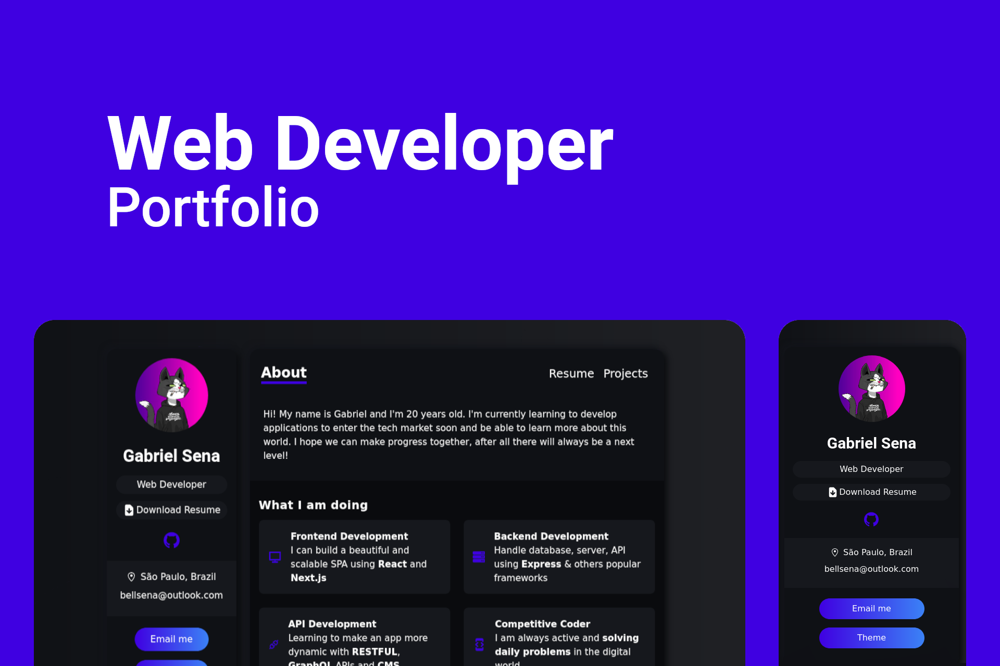

# Web Developer | Portfolio

> Construction of a web Portfolio for developers, using React and all the tools provided by the Next.js framework to make the page more dynamic.
> The Framer Motion library was also used to add minimalist and smooth, yet sophisticated animations. The project was taught on the channel
> <b>Backbench Coder.

